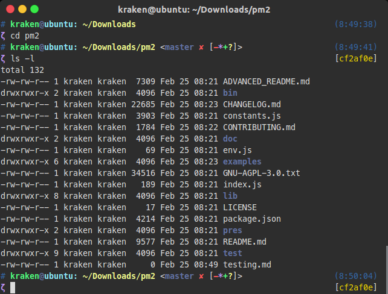

# Zeta ZSH Theme

Another :star:theme for oh-my-zsh

## Installation
1. Copy file `zeta.zsh-theme` to `$ZSH_CUSTOM/themes` folder.
(You may need to create `themes` folder if it doesn't exist)

2. Set theme to `zeta` in `~/.zshrc`:
```
ZSH_THEME="zeta"
```

## Screenshot


## Features
* User name
* Machine name
* Current working directory
* Git branch
* Git status
    * `✔` —— Clean branch
    * `✘` —— Dirty branch
    * `+` —— Added files
    * `-` —— Deleted files
    * `*` —— Modified files
    * `>` —— Renamed files
    * `=` —— Unmerged changes
    * `?` —— Untracked changes
* Prompt indicator turns red if the last run fails

## License
The MIT License.
